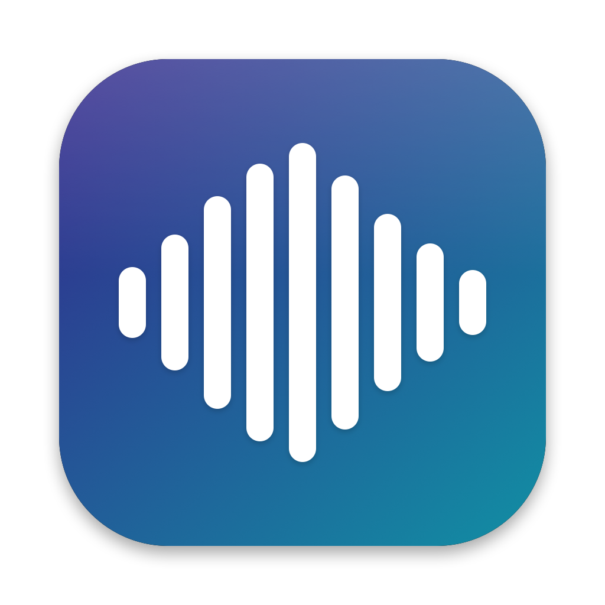

<p align="center"></p>

# Utter

Local-first dictation for macOS. Hold a shortcut, speak, release: your words appear at the cursor in any app. Transcription runs entirely on your Mac (Apple Silicon, Metal); nothing is sent anywhere unless you turn on an optional cloud processor.

- **Fast.** Parakeet V3 transcribes ~5 s of speech in about 80 ms. Long dictations are transcribed at natural pauses while you speak, so a 5-minute dictation is ready about 0.3 s after you let go ([benchmarks](docs/BENCHMARKS.md)).
- **Reliable insertion.** It types into the field through Accessibility where the app supports it. It falls back to paste (restoring your whole clipboard afterwards) or to typing, and you can choose per app. It never types into password fields.
- **Your words, your way.** Personal vocabulary ("HoldMyCode", "PostgreSQL"…) corrects common mishearings. Modes: Exact, Clean, Code, and Professional/Custom with an optional AI processor (Ollama on your Mac, or Anthropic if you opt in).
- **Native.** SwiftUI/AppKit menu bar app. A floating recording overlay that never steals focus. Searchable local history.
- **Models.** Parakeet V3/V2, Whisper Small/Medium/Large v3/Large v3 Turbo, SenseVoice Small, Moonshine Base. Download, verify, switch and delete them in the Model Manager.

## Install

1. Download `Utter-<version>.dmg` from [Releases](https://github.com/vedjrr/Utter/releases), open it, and drag **Utter** to **Applications**.
   Or, once the cask is published: `brew install --cask utter`.
2. Open Utter. A waveform icon appears in the menu bar and the setup window asks for:
   - **Microphone**: to hear you while you hold the shortcut.
   - **Accessibility**: to see the shortcut in every app and put text at your cursor.
3. The Model Manager opens if no model is installed. **Parakeet V3** (740 MB) is recommended.
4. Click into any text field, hold **⌥ Space**, speak, release.

Requirements: macOS 14 or later on Apple Silicon.

## Use

| | |
|---|---|
| Dictate | Hold ⌥ Space (or your shortcut), speak, release. Or choose **Press to Start and Stop** in the menu → Shortcut. |
| Change the shortcut | Menu → Shortcut → Change Shortcut… |
| Pick a mode | Menu → Mode (Exact, Clean, Code, Professional, Custom) |
| Pick a microphone | Menu → Microphone. **Keep Microphone Ready** makes recording start instantly. |
| Vocabulary, insertion, language, privacy | Menu → Settings… (⌘,) |
| Past dictations | Menu → History… (⌘Y) |

## Privacy

- Audio is processed on your Mac and is never stored, unless you turn on **Settings → Privacy → Keep the audio**.
- Network is used only to download models, to check for updates (Sparkle, EdDSA-signed), and for the Anthropic processor if you choose it and turn off Local-only mode.
- History (text only by default) lives in `~/Library/Application Support/Utter/History/`. Turn it off or clear it in Settings → Privacy.

## Uninstall

1. Quit Utter (menu → Quit Utter).
2. Remove the app and everything it stored:

   ```sh
   ./scripts/uninstall.sh          # from a clone of this repository, or run these by hand:
   rm -rf /Applications/Utter.app
   rm -rf ~/Library/Application\ Support/Utter        # models (up to several GB), history
   rm -rf ~/Library/Logs/Utter ~/Library/Caches/dev.utter.mac "$(getconf DARWIN_USER_CACHE_DIR)dev.utter.mac"
   defaults delete dev.utter.mac                       # settings
   security delete-generic-password -s dev.utter.mac.processing -a anthropic-api-key 2>/dev/null   # cloud key, if saved
   ```
3. Optionally remove Utter from System Settings → Privacy & Security → Microphone and Accessibility, or run `tccutil reset All dev.utter.mac`.

## Build from source

Needs the Xcode Command Line Tools, Rust (`rustup`), and CMake (`brew install cmake`).

```sh
make models   # downloads the test models (pinned revisions, SHA-256 checked)
make test     # Rust + Swift tests, including real-model tests
make build    # build/Utter.app (signed with your Apple Development identity if you have one)
make bench    # bench/results/<date>.json + docs/BENCHMARKS.md
```

The architecture and its decisions are in [docs/ARCHITECTURE.md](docs/ARCHITECTURE.md). Releasing is described in [docs/RELEASING.md](docs/RELEASING.md), and the build kit in [docs/KIT.md](docs/KIT.md).

## License

MIT. Model licences are shown in the Model Manager: most are MIT or Apache-2.0, and SenseVoice asks you to accept its licence before download.
